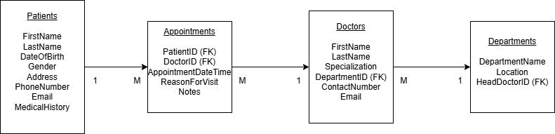

# Clinic Booking System

## Description
This project implements a MySQL database for a Clinic Booking System. It tracks patients, doctors, appointments and departments. The system allows the clinic to store patient details, doctor information, appointments and the departments they belong to.

## How to Run/Setup the Project
1. Ensure you have a MySQL database server running.
2. Download the `clinic.sql` file.
3. Open MySQL Workbench or another MySQL client that can connect to your MySQL server.
4. Execute the `clinic.sql` file. This will create the necessary tables (Patients, Doctors, Appointments, Departments) and their relationships.

## ERD

## Possible Uses
This system can be used to:
* Schedule and manage patient appointments.
* Store and retrieve patient medical history and contact information.
* Manage doctor profiles, specialties, and departmental affiliations.
* Organize clinic staff by department.
* Query appointment schedules for patients and doctors.